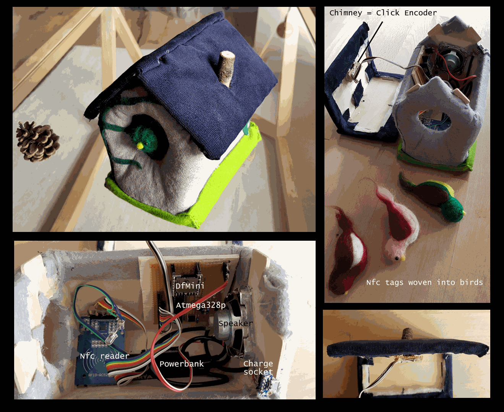

### Nfc-Tag controlled Mp3 player

Fabrication example: A wooden bird's house that contains all components, Nfc tags woven in "birds".
# "TonUINO alternative firmware"

Project site, documentation, how to's and DIY instructions can be found on [github.schallbert.com](https://schallbert.github.io/projects-software/tonuino/).
Repository is under LGPLV2.1 license

## Additional specific notes:
RAM usage of >75% will likely cause segfaults (been through that!)
When battery powered, I'd propose to use a bi-stable relay or TTL so the System can keep alive without continuously using power for relay coils and - when finished - cut its own power supply.
Only tested 1k Mifare Nfc tags, 4k and Mini will also work, Ultralight SHOULD work (but not integration tested).