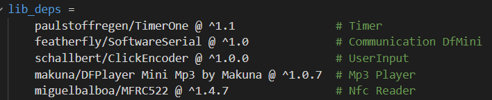
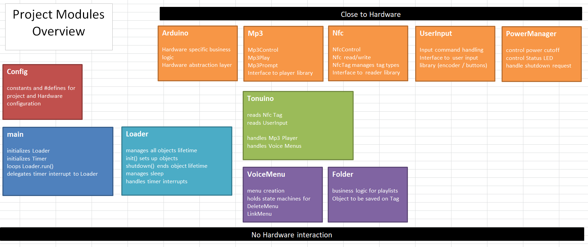
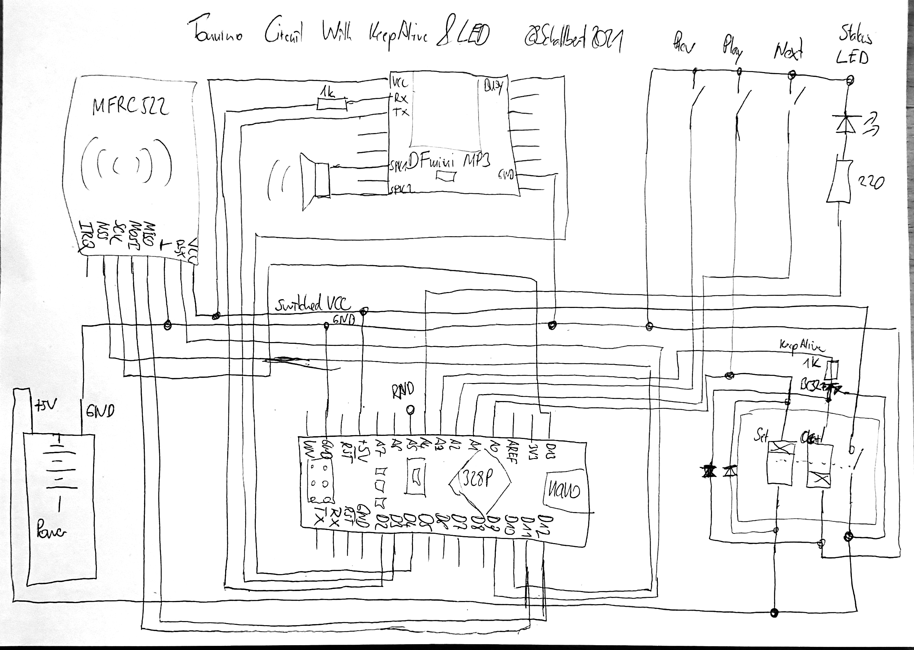

### Nfc-Tag controlled Mp3 player
# "TonUINO alternative firmware"

Idea and fantastic execution found on Thorsten Voß's blog, 
re-wrote the code from scratch for even better structure, readability, maintainability, and extensibility.
Does not support advanced config features (yet) like preset lullabye timer, init volume etc.

## Features:
* Configurable user input (buttons or encoder)
* Auto-Poweroff when no button pressed for a configurable time
* Power on via "play" button press
* Autoplay feature
* Status Led feature
* User Input lock/unlock feature
* Multiple playmodes [Album, Random, SaveProgress, OneTrack] available per Nfc Tag
* Voice menus for linking or deletion of Nfc Tags
* Optimized for battery applications (e.g. powerbank) using sleep states
* Low power consumption @5V: ~40mA in idle, ~75mA playing medium volume
* Config file for init volume, lullabye timer etc.
* Auto-recovery from stuck prompts
* Voice prompts for most common state errors

## So much work...
My first real OO C++ project, and, maybe, it was a little big to start with.
All these concepts of clean code, writing to an interface, first-time usage of Platformio as IDE,
utilizing the googletest unit test framework, using coding patterns like factory or Dependency Injection took nearly a year of evenings before this project could be completed. And there's always something left to refactor and to improve.

### Quick facts
* 400+ hours of total development time...
* Unit test suite of 250+ test cases
* Serial debug output configurable
* Loosely coupled C++ OO architecture
* Individual modules with clear tasks, scaleable and easily accessible for future feature add
* custom Hardware abstraction layer; most of the code should be portable to other mcus without changes
* custom Dependency Injection framework (Loader class)

## Additional notes:
RAM usage of >75% will likely cause segfaults (been through that!)
When battery powered, I'd propose to use a bi-stable relay so the Tonuino 2.0 can keep alive without using additional power for coils and - when finished - cut its own power supply.
Only tested 1k Mifare Nfc tags, 4k and Mini will also work, Ultralight SHOULD work (but not integration tested).

# Documentation
The Project is written almost exclusively in C++ and build for Arduino Framework - tested on an Arduino nano board - using the [PlatformIO IDE](https://platformio.org/).
The following sections show the structure.

## Project Module overview
Folder name in `/lib` | Purpose
--- | ---
Arduino	| minimalistic close-to-Hardware implementations, not unit-testable
Arduino_HardwareAbstraction	| Hardware abstraction to enable portability and testing
Config | System configuration parameters
Folder | Playlist and playmode business logic
Loader | Dependency Injection Framework
MessageHandler | System messages and Debug Framework
Mp3 | Mp3 control (Status, Folder, Prompts, Advertisements)
Nfc | Tag control (Status, Read, Write, Delete)
PowerManager | Control Status Led and Keep Alive based on system state
Tonuino | Main task scheduler
UserInput | Button or Encoder input handling
Utilities | Timers, Led Control, Pin control
VoiceMenu | Link / Delete / Config menu business logic

## External Libraries

Auto-install through Platformio on initial build.

## Class Diagrams
 Class diagrams would have been too much non-automated work...

## Acceptance tests
 ##### Switching ON 
 System Pre: System is OFF 
 Action | Expectation
 --- | --- 
 press Play/Pause button | LED flashes slowly?
 press Play/pause button | Welcome prompt plays?
 
 ##### Switching OFF 
 System Pre: System is ON
 Action | Expectation
  --- | --- 
 Playback on pause, no button input | System switches off after a time?
 System shutdown | Farewell prompt plays?
 System shutdown | LED switched off?
 
 ##### Play Help Prompt 
 System Pre: System is ON
 Action | Expectation
  --- | --- 
 Long press Play/Pause button | Help prompt plays?
 Help prompty playing | Can be interrupted with any button press?
 
 ##### Behavior without Tag
 System Pre: System is ON, no Tag present
  Action | Expectation
  --- | --- 
  press Play/Pause button | prompts "couldn't find track" error?
  press Next button | prompts "couldn't find track" error?
  press Prev button | prompts "couldn't find track" error?
  doubleclick Play/Pause button | Delete Menu prompt played?
  
   ##### Behavior with Tag
  System Pre: System is ON, linked Tag available
  Precondition | Action | Expectation
  --- | --- | ---
  no Tag placed | place known Tag | starts Playback of correct Folder?
  active playback | press Next button | plays next track?
  active playback | press Next button | next track in accordance with selected playMode of Folder?
  active playback | long press Next button | increases volume?
  active playback | press Prev button | plays previous track?
  active playback | press Prev button | previous track in accordance with selected playMode of Folder?
  active playback | long press Prev button | decreases volume?
  active playback | press Play/Pause button | pauses track?
  paused playback | press Play/Pause button | resumes track?
  active playback | doubleclick Play/Pause button | Lock prompt played?
  active playback | doubleclick Play/Pause button | Playback resumes after Lock prompt played?
  active playback | doubleclick Play/Pause button | locks button input?
  locked button input | doubleclick Play/Pause button | Unlock prompt played?
  locked button input | doubleclick Play/Pause button | Playback resumes after Unlock prompt played?
  locked button input | doubleclick Play/Pause button | unlocks button input?
  paused playback | doubleclick Play/Pause button | Playback resumes after Lock prompt played?
  
  ##### Behavior with unlinked Tag
  System Pre: System is ON
  Action | Expectation
  --- | ---
  place unlinked Tag | plays LinkMenu Prompt?
  navigate through LinkMenu | plays Configuration Success Prompt?
  place Tag again | plays linked folder? 

## Unit tests
Are configured an can be built and run using `pio test -e desktop -f desktop` in the PlatformIO CLI terminal. Note that *googletest* will require `gcc` with some libraries to be installed, how to can be found [here](https://community.platformio.org/t/unit-testing-with-gtest-gmock-on-env-desktop-on-arduino-platform/14354). 

# Hardware
## Material
Minimal discrete parts approach
Amount | Item | Purpose
--- | --- | ---
1 | Arduino (e.g. Nano) | Brains
1 | Dfplayer Mini Mp3 Player | Mouth
1 | Micro SD Card | Memory
1 | MFRC522 Nfc Reader | Psi-Sense
1 | Bistable Relay 5V, e.g. HFE20 | Coffee - no sleep
2 | Diodes e.g. 1n4007 | vene valve
1 | PNP Transistor e.g. BC327 | Coffee maker switch
2 | Resistors 1k | blood-stream conditioner
1 | Resistor 220 | dim blink strength
1 | LED, color of choice | blink
1 | Powerbank/ 5V supply | Food
3 | push buttons, e.g. cherry MX keys | pressure sensors
1 | speaker, e.g.5W@4Ohms | Lungs
1 | USB-A plug | Straw
1 | housing | Body

Jumper wires, PCB, Sockets, and expendable materials as you deem fit
Same as for the "original" project; Alternatively buy one rotary encoder instead of push buttons and configure the project to use it. 
As the system is optimized for battery usage, take a bi-stable relay or a JFET transistor (with low gate voltage and low Source-Drain voltage drop) for keepAlive functionality mitigating additional current add through always-on relay coils. A cheap powerbank will last for many hours. Alternatively, e.g. 3xAA batteries can be used - but the Dfmini will be really noisy if not enough current can be supplied (and may even get bricked through current surges and running resets, so beware).

## Schematics

